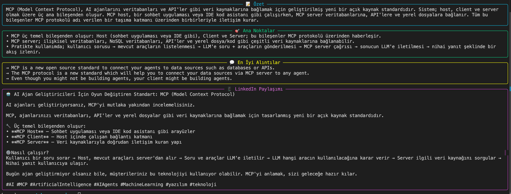

# 🎥 YouTube AI Summarizer

A Python CLI tool that analyzes YouTube videos using the Claude API and generates structured summaries in seconds.

Give it a YouTube URL, get back:
- 📝 A 3-5 sentence summary
- 🎯 Key takeaways
- 💬 Best quotes from the video
- 📱 A ready-to-post LinkedIn draft

## ✨ Features

- Auto-detects Turkish and English transcripts, generates output in Turkish (easily customizable)
- Supports standard YouTube URLs, short links, and Shorts
- Beautiful, professional terminal output powered by `rich`
- Automatic retry with exponential backoff on API errors
- Clean error handling for invalid URLs and missing transcripts

## 🛠️ Tech Stack

- **Python 3.9+**
- **Anthropic Claude API** — analysis and summarization
- **youtube-transcript-api** — transcript fetching
- **rich** — terminal styling
- **python-dotenv** — environment variable management

## 🚀 Installation

\`\`\`bash
# Clone the repository
git clone https://github.com/erenmd73/youtube-summarizer.git
cd youtube-summarizer

# Create and activate a virtual environment
python3 -m venv venv
source venv/bin/activate   # On Windows: venv\Scripts\activate

# Install dependencies
pip install anthropic youtube-transcript-api rich python-dotenv

# Create a .env file with your Claude API key
echo "ANTHROPIC_API_KEY=your_api_key_here" > .env
\`\`\`

Get your API key from the [Anthropic Console](https://console.anthropic.com).

## 📖 Usage

\`\`\`bash
python summarizer.py "https://www.youtube.com/watch?v=VIDEO_ID"
\`\`\`

The tool will extract the video transcript, send it to Claude for analysis, and display the structured output in your terminal.

## 🧠 How It Works

1. Extracts the video ID from the URL using regex
2. Fetches the transcript via `youtube-transcript-api` (falls back to English if Turkish is unavailable)
3. Sends the transcript to Claude with a structured prompt requesting JSON output
4. Parses the JSON response and renders it in styled panels using `rich`

## 🔮 Roadmap

- [ ] Batch processing for multiple videos
- [ ] Export output to Markdown or JSON files
- [ ] Wider language support
- [ ] Web interface (Streamlit or FastAPI)
- [ ] Custom output formats (Twitter threads, blog drafts, etc.)

## 👤 Author

**Eren Cızdaman** · [GitHub](https://github.com/erenmd73)

---

Built as a hands-on exploration of the Claude API and modern Python tooling.